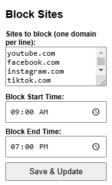
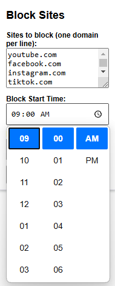

# 🚫 jBlocker  
*A Chrome extension to block distracting websites during focused work sessions.*  

 

---

## 📖 Overview  
**jBlocker** is a productivity-focused Chrome extension that helps you stay focused by blocking access to specified websites during user-defined time periods. Perfect for students, remote workers, or anyone seeking distraction-free time!

### Key Features:
- ⏰ **Schedule Blocking**: Define exact time frames for website blocking
- 🌐 **Multi-Site Support**: Block unlimited websites (e.g., social media, streaming)
- 🛠️ **Instant Activation**: Toggle blocking with one click
- 🔄 **Background Operation**: Works silently without interrupting your workflow

---

## 🖼️ Screenshots  

<div style="display: flex; gap: 30px; justify-content: space-between; flex-wrap: wrap;">

  <div style="flex: 1; min-width: 300px;">
    <h3>Website Blocking Interface</h3>
    
  </div>

  <div style="flex: 1; min-width: 300px;">
    <h3>Time Schedule Configuration</h3>
    
  </div>

</div>
---

## 🎮 Usage  
1. **Click the jBlocker icon** in Chrome's toolbar.  

2. **Add Websites to Block**:  
   - Enter one domain per line in the textarea.  
   - Example:  
     ```  
     youtube.com  
     twitter.com  
     instagram.com  
     ```  

3. **Set Time Frame**:  
   - Use the time pickers to define blocking hours.  

4. **Toggle Activation**:  
   - Click the **Save & Update** button to start/stop blocking at your wish. 

---

## 🛠️ Installation  
1. **Clone the repository**  
   ```bash
   git clone https://github.com/justvicthor/jBlocker.git
2. **Enable Developer Mode in Chrome**
    - Visit `chrome://extensions/`
    - Toggle **Developer mode** (top-right corner)
3. **Load the Extension**
    - Click Load unpacked
    - Select the cloned jBlocker folder

---

## 🤝 Contributing  
Contributions make open-source magical! Here’s how to help:

1. **Fork the repository**
2. **Create a Feature Branch**  
   ```bash
   git checkout -b feature/amazing-feature
3. **Commit Changes**
    ```bash
   git commit -m 'Add some amazing feature'
4. **Push to Branch**
    ```bash
   git push origin feature/amazing-feature
5. **Open a Pull Request**

---

## 📜 License  
Distributed under the MIT License. See [LICENSE](./docs/LICENSE) for details. 